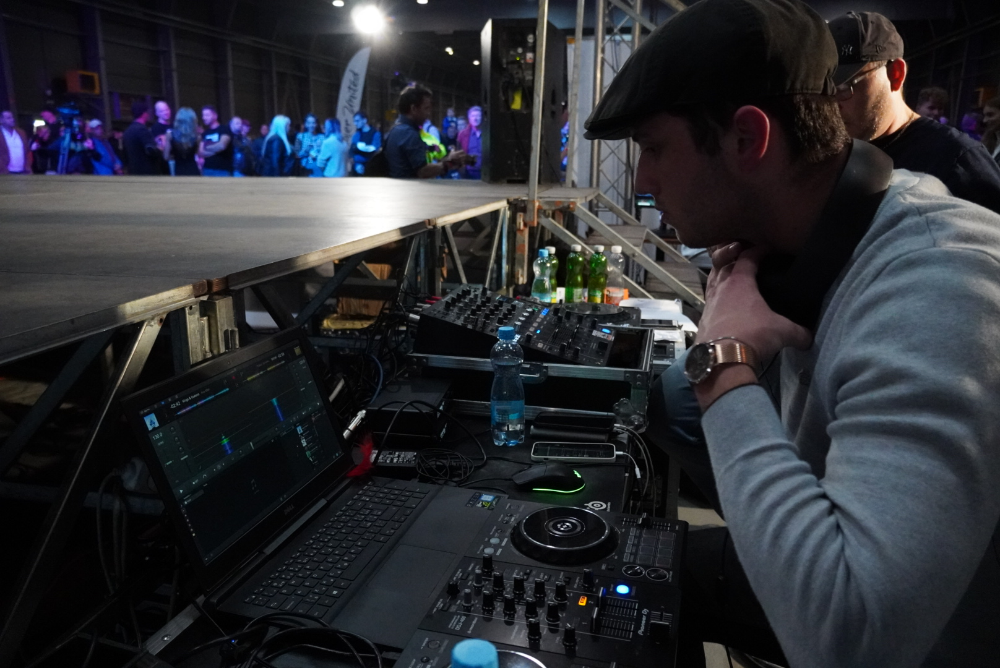

## My Story

Hello, I am Ronald and I am freelancer based in Prague, in my free time I do sport fencing.

Hello, my name is Ronald Steiniger and I come from eastern Slovakia from the city called Prešov. As a little boy, I was very hyperactive and tried a lot of sports. I went to art school and I was also a fanatic of computer games. By the time I was growing up, I was trying to find something I enjoyed because I was actively doing a lot of things at once, but none at 100%. Also, when I got to high school I was forced to find fewer activities since I was all day at school. So I found sport fencing and I've been doing it so far.

About my artistic and work skills, I have had a relationship with art since I was young, thats why I choose to continue on VSKK. I loved to create modern digital art, whether it was 3D or virtual visualization. Throughout my practice, I have tried various professions such as lighting designer, video creator, photographer, drone operator. At the moment, what I enjoy most is watching the world from heights and taking artistic shots with my drone.

[homepage](https://github.com/RonaldRonno/english-for-designers/blob/main/README.md)
